# 🖥️ Active Directory Home Lab

**Environment:** Windows Server 2025 · Azure VM (Standard_B2s) · PowerShell ISE  
**Cloud Provider:** Microsoft Azure  


---

## 📋 What This Lab Is

This lab covers the identity backbone of virtually every enterprise Windows environment — Active Directory. I built a fully functioning domain from scratch on an Azure VM: promoted a Windows Server 2025 instance to Domain Controller, structured an organisational hierarchy with OUs and security groups, provisioned user accounts using PowerShell, and enforced security policies across the domain through Group Policy Objects.

Every task in this lab maps directly to something that happens in a real sysadmin role — account provisioning, access control design, policy enforcement. Understanding how Active Directory works at this level is also foundational to cloud identity work, since Microsoft Entra ID (formerly Azure AD) uses the same mental model at cloud scale.

---

## 🏗️ Architecture

```
┌──────────────────────────────────────────────────────────────────┐
│                Microsoft Azure — East US                         │
│                                                                  │
│  ┌────────────────────────────────────────────────────────────┐  │
│  │     Windows Server 2025 VM — Domain Controller             │  │
│  │     lab.local forest · AD DS · DNS                         │  │
│  │                                                            │  │
│  │  ┌──────────────┐  ┌──────────────┐  ┌─────────────────┐  │  │
│  │  │   AD DS      │  │     DNS      │  │  Group Policy   │  │  │
│  │  │ Identity &   │  │ Name resol.  │  │  GPO enforce.   │  │  │
│  │  │    auth      │  │              │  │                 │  │  │
│  │  └──────────────┘  └──────────────┘  └─────────────────┘  │  │
│  │                           │                                │  │
│  │        ┌──────────────────┼──────────────────┐            │  │
│  │        ▼                  ▼                  ▼            │  │
│  │  ┌──────────┐  ┌───────────────┐  ┌────────┐  ┌────────┐ │  │
│  │  │  OU=IT   │  │  OU=Finance   │  │ OU=HR  │  │OU=Sales│ │  │
│  │  │IT_Admins │  │Finance_Users  │  │HR_Users│  │Sales_  │ │  │
│  │  └────┬─────┘  └──────┬────────┘  └───┬────┘  │Users   │ │  │
│  │       │               │               │       └───┬────┘ │  │
│  │  alice.chen       bob.patel      carol.jones  david.smith │  │
│  │                                                           │  │
│  │  ┌────────────────────────────────────────────────────┐  │  │
│  │  │  IT Security Policy GPO                            │  │  │
│  │  │  12-char password · Screen lock 900s · USB blocked │  │  │
│  │  └────────────────────────────────────────────────────┘  │  │
│  └────────────────────────────────────────────────────────────┘  │
└──────────────────────────────────────────────────────────────────┘
```

The Domain Controller is the authoritative source for every identity decision in the domain. When a user logs into any domain-joined machine, their credentials are verified against this server. When a GPO is updated, it propagates to every machine in the linked OU automatically on next login or `gpupdate`. Everything flows through the DC.

---

## 🧠 Concepts I Applied

**Active Directory** is the identity backbone of Windows enterprise environments. It controls which users can log into which machines, which groups can access which resources, and which policies apply to which parts of the organisation. One account, one place to manage it — every door it opens and closes is controlled from here.

**Domain Controller** is a server that runs Active Directory. It is the authoritative source for authentication in the domain. Promoting a Windows Server to DC is the step that creates the forest, establishes DNS for the domain, and makes the server the identity source for everything that joins. Before promotion it's just a server. After it — it owns the domain.

**Organisational Units** are logical containers inside Active Directory. I used them to organise users and groups by department. The real value of OUs isn't organisation — it's that you can link a Group Policy Object to an OU and every user and machine inside it gets the policy applied automatically.

**Security Groups** are how role-based access control works in practice. Instead of granting permissions to individual users, you grant them to a group and manage who's in the group. Add someone to `Finance_Users` and they inherit every Finance permission instantly. Remove them and every door closes at once. This scales to thousands of users in a way that per-user permissions never could.

**Group Policy Objects** are collections of settings that get enforced automatically across every user and machine inside a linked OU. No per-machine visits, no manual configuration — one GPO, applied everywhere the moment a machine runs `gpupdate`. Password complexity, screen lock timers, USB restrictions — all centrally controlled.

**PowerShell for AD** is how this gets done at scale in real environments. Clicking through a GUI to create 340 users isn't realistic. The same commands that create one user create a thousand — and they're repeatable, auditable, and scriptable.

---

## 🛠️ What I Did

### Step 1 — Deployed Windows Server 2025 on Azure

Provisioned a **Standard_B2s** VM in Azure (2 vCPU, 4GB RAM) running Windows Server 2025 Datacenter. Configured the NSG to allow RDP on port 3389, then connected via the native Remote Desktop app with clipboard sharing enabled so commands could be copied in cleanly.

Stopped the VM at the end of every session to avoid burning through free tier credits — a B2s costs roughly $0.05/hour when running.

---

### Step 2 — Installed Active Directory Domain Services

Inside the VM, opened Server Manager and navigated to **Manage → Add Roles and Features**. Selected **Active Directory Domain Services** and let the wizard install the role and management tools.

Also installed the **Group Policy Management Console** immediately after — a separate feature that's required for GPO work later and easy to forget.

```powershell
# Install AD DS role with management tools
Install-WindowsFeature -Name AD-Domain-Services -IncludeManagementTools

# Install Group Policy Management Console
Install-WindowsFeature -Name GPMC
```

**📸 Screenshot — Server Manager dashboard showing AD DS, DNS, and all roles healthy:**

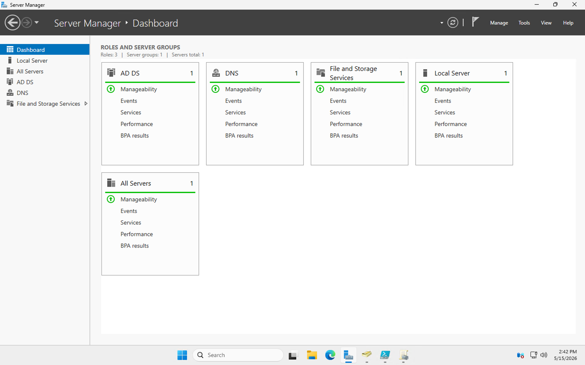

The dashboard confirms all three roles are running — AD DS, DNS, and Local Server all showing green. DNS gets installed automatically alongside AD DS because the domain controller needs to serve DNS for the domain to function.

---

### Step 3 — Promoted to Domain Controller

With the role installed, clicked the yellow flag notification in Server Manager and selected **Promote this server to a domain controller**. Chose **Add a new forest**, set the root domain name to `lab.local`, and walked through the wizard — setting a DSRM password for disaster recovery and accepting the DNS defaults.

```powershell
# Promote via PowerShell
Import-Module ADDSDeployment
Install-ADDSForest `
  -DomainName 'lab.local' `
  -DomainNetBiosName 'LAB' `
  -InstallDns:$true `
  -SafeModeAdministratorPassword (ConvertTo-SecureString 'YourDSRMPassword!' -AsPlainText -Force) `
  -Force:$true
```

**📸 Screenshot — AD DS Configuration Wizard showing new forest creation with lab.local:**

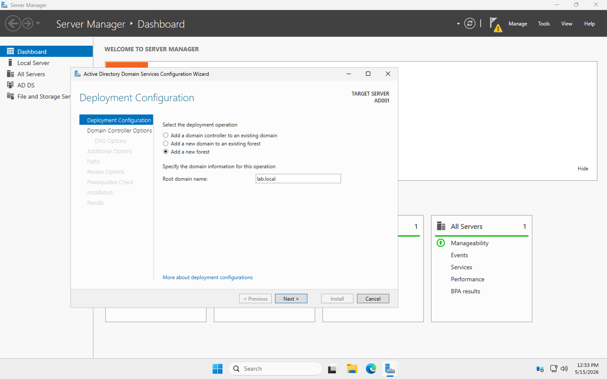

The wizard shows `Add a new forest` selected and the root domain name set to `lab.local`. The target server shown in the top right is `AD001` — this machine. After clicking Install, the server restarted automatically and came back as the domain controller for lab.local.

---

### Step 4 — Built the Organisational Structure

#### Creating Organisational Units

Opened **Active Directory Users and Computers** from the Tools menu and created four department OUs plus one for computers. Used PowerShell to do it in one block rather than clicking through the GUI four times.

```powershell
New-ADOrganizationalUnit -Name "IT"        -Path "DC=lab,DC=local"
New-ADOrganizationalUnit -Name "Finance"   -Path "DC=lab,DC=local"
New-ADOrganizationalUnit -Name "HR"        -Path "DC=lab,DC=local"
New-ADOrganizationalUnit -Name "Sales"     -Path "DC=lab,DC=local"
New-ADOrganizationalUnit -Name "Computers" -Path "DC=lab,DC=local"
```

**📸 Screenshot — PowerShell ISE showing OU creation commands executed successfully:**

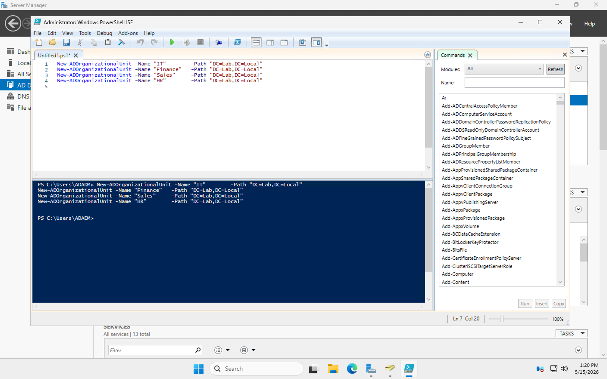

The terminal pane at the bottom confirms all four `New-ADOrganizationalUnit` commands ran without error. The ISE script pane at the top shows the exact commands used — keeping the script open makes it easy to reference and rerun if needed.

---

#### Creating Security Groups

Created one security group per department, scoped to the matching OU. Global scope means these groups can be used for access control anywhere in the domain.

```powershell
New-ADGroup -Name "IT_Admins"     -GroupScope Global -GroupCategory Security -Path "OU=IT,DC=lab,DC=local"
New-ADGroup -Name "Finance_Users" -GroupScope Global -GroupCategory Security -Path "OU=Finance,DC=lab,DC=local"
New-ADGroup -Name "HR_Users"      -GroupScope Global -GroupCategory Security -Path "OU=HR,DC=lab,DC=local"
New-ADGroup -Name "Sales_Users"   -GroupScope Global -GroupCategory Security -Path "OU=Sales,DC=lab,DC=local"
```

**📸 Screenshot — PowerShell ISE showing all four security groups being created:**

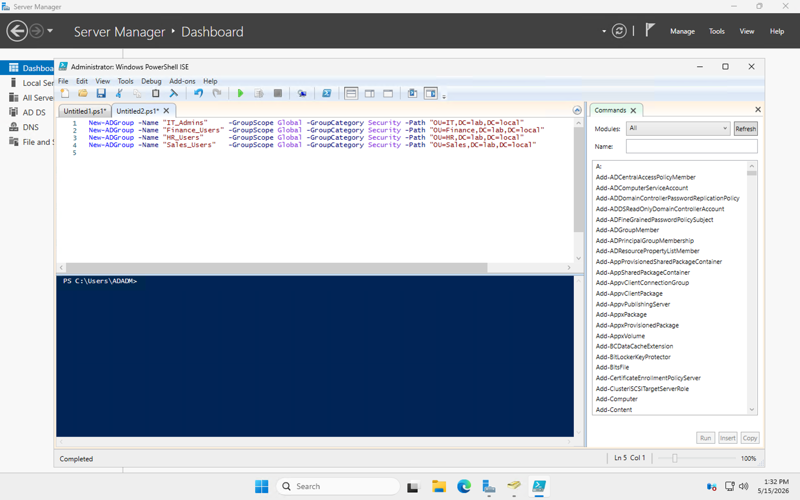

Each `New-ADGroup` command creates a Global Security group inside its department OU. The `-Path` parameter places each group directly in the correct OU so it's scoped from creation — no manual moving required.

---

#### Provisioning User Accounts

Created four users — one per department — and assigned them to their respective groups in the same session. The key here is running the entire block at once; the `$password` variable has to be defined before the `New-ADUser` commands reference it.

```powershell
# Define password variable first
$password = ConvertTo-SecureString "Welcome@2026!" -AsPlainText -Force

# Create users in their department OUs
New-ADUser -Name "alice.chen" -GivenName "Alice" -Surname "Chen" `
  -SamAccountName "alice.chen" -UserPrincipalName "alice.chen@lab.local" `
  -Path "OU=IT,DC=lab,DC=local" -AccountPassword $password -Enabled $true

New-ADUser -Name "bob.patel" -GivenName "Bob" -Surname "Patel" `
  -SamAccountName "bob.patel" -UserPrincipalName "bob.patel@lab.local" `
  -Path "OU=Finance,DC=lab,DC=local" -AccountPassword $password -Enabled $true

New-ADUser -Name "carol.jones" -GivenName "Carol" -Surname "Jones" `
  -SamAccountName "carol.jones" -UserPrincipalName "carol.jones@lab.local" `
  -Path "OU=HR,DC=lab,DC=local" -AccountPassword $password -Enabled $true

New-ADUser -Name "david.smith" -GivenName "David" -Surname "Smith" `
  -SamAccountName "david.smith" -UserPrincipalName "david.smith@lab.local" `
  -Path "OU=Sales,DC=lab,DC=local" -AccountPassword $password -Enabled $true
```

**📸 Screenshot — PowerShell ISE showing all four user accounts being created:**


The script pane shows all four `New-ADUser` commands with full UPN formatting and department OU paths. The terminal below confirms the commands ran cleanly with no errors — all four accounts are now enabled in their respective OUs.

---

#### Assigning Group Memberships

Added each user to their department security group to complete the RBAC structure.

```powershell
Add-ADGroupMember -Identity "IT_Admins"     -Members "alice.chen"
Add-ADGroupMember -Identity "Finance_Users" -Members "bob.patel"
Add-ADGroupMember -Identity "HR_Users"      -Members "carol.jones"
Add-ADGroupMember -Identity "Sales_Users"   -Members "david.smith"
```

**📸 Screenshot — PowerShell showing group membership assignments executed:**

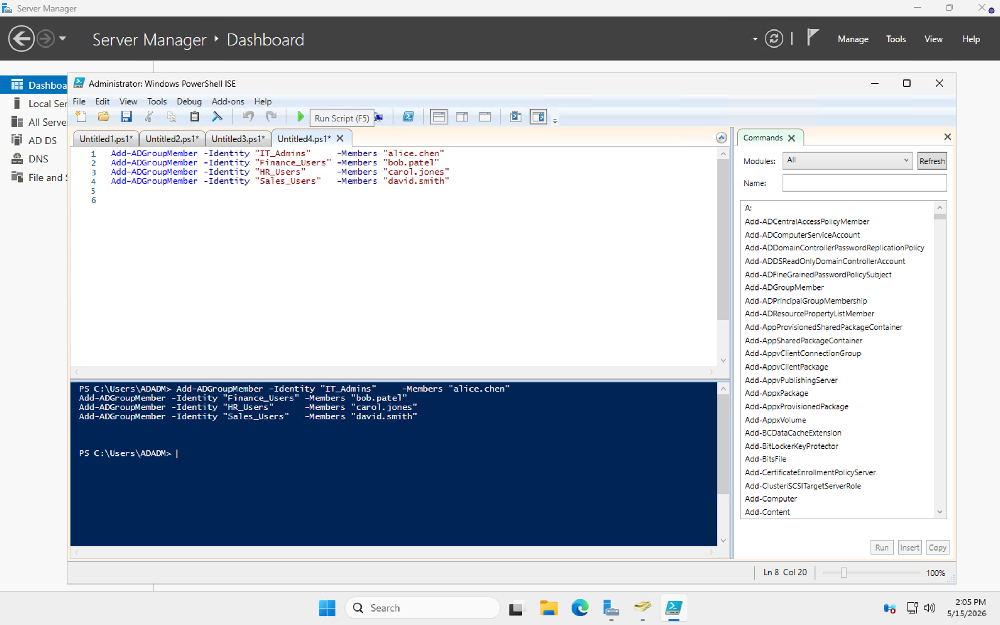

The terminal confirms all four `Add-ADGroupMember` commands completed without error. From this point alice.chen inherits every permission the IT_Admins group has, bob.patel inherits Finance_Users permissions, and so on — the entire access model is group-driven, not user-driven.

---

### Step 5 — Configured Group Policy

Opened **Group Policy Management** from the Tools menu in Server Manager. The left panel shows the full domain tree — Forest: lab.local, Domains, lab.local, and all the OUs underneath.

**📸 Screenshot — Group Policy Management console showing the full lab.local domain structure:**

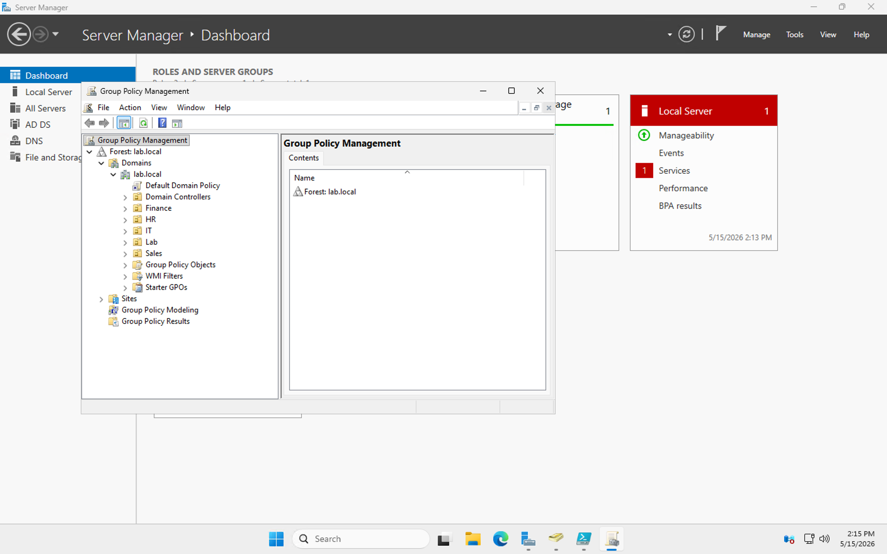

The tree shows Finance, HR, IT, Lab, and Sales OUs all present under lab.local, confirming the OU structure from Step 4 is visible and manageable from GPMC.

---

Right-clicked the **IT** OU and selected **Create a GPO in this domain and link it here**. Named it `GPO1` to link it to the IT OU.

**📸 Screenshot — New GPO creation dialog linked to the IT OU:**

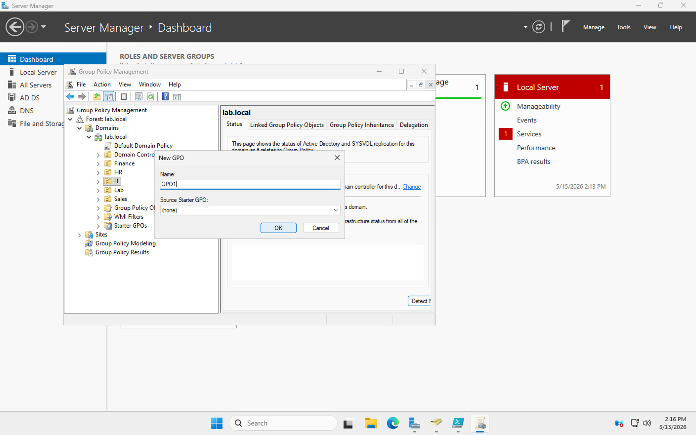

The dialog shows the new GPO being created with the IT OU visible in the left panel tree — confirming the GPO will be linked directly to IT from the moment it's created.

---

Right-clicked the GPO and selected **Edit** to open the Group Policy Management Editor. Configured four security settings:

---

**Setting 1 — Minimum Password Length (12 characters)**

Navigated to: `Computer Configuration → Windows Settings → Security Settings → Account Policies → Password Policy`

```
Minimum password length: 12 characters
```

**📸 Screenshot — Password Policy showing minimum length set to 12 characters:**

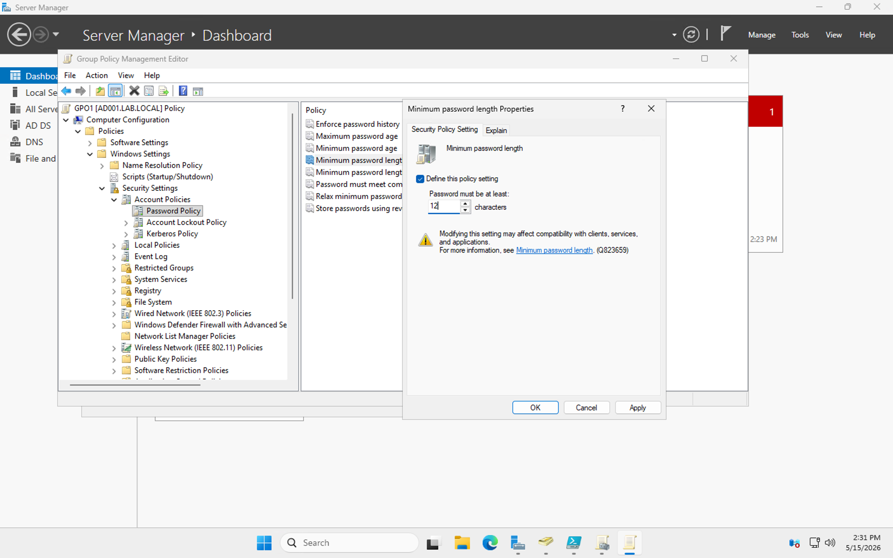

The properties dialog shows `Password must be at least: 12 characters` with the policy defined checkbox checked. The navigation path on the left confirms the location inside the GPO tree.

---

**Setting 2 — Password Complexity Enabled**

Same Password Policy node — enabled complexity requirements so passwords must contain uppercase, lowercase, numbers, and symbols.

**📸 Screenshot — Password complexity requirements set to Enabled:**

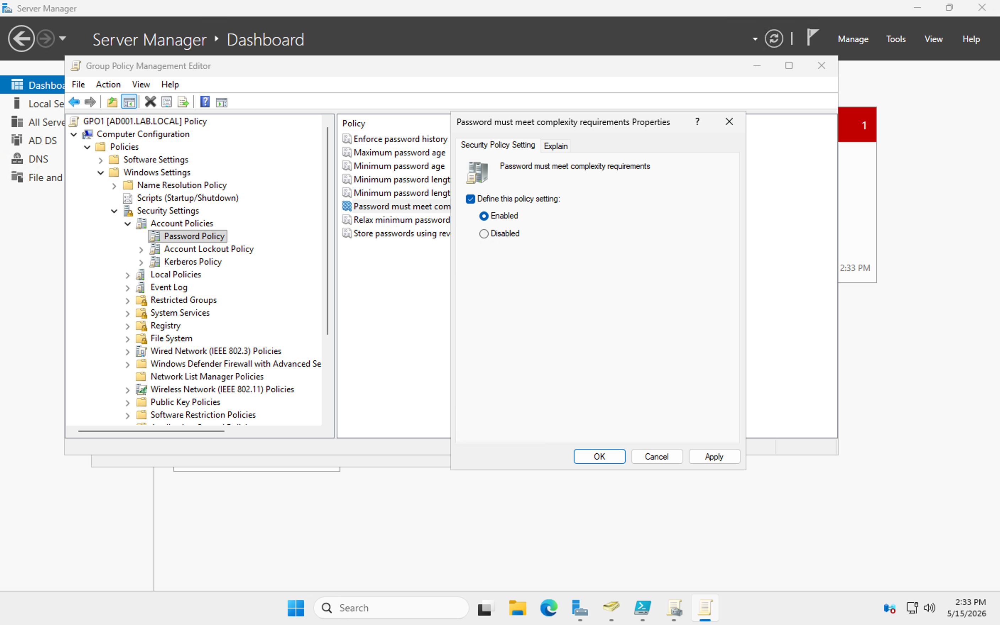

The `Password must meet complexity requirements` properties dialog shows `Enabled` selected. The Password Policy summary view in the screenshot below shows both settings active simultaneously — minimum length at 12 characters and complexity showing as Enabled.

**📸 Screenshot — Password Policy summary showing both settings configured:**

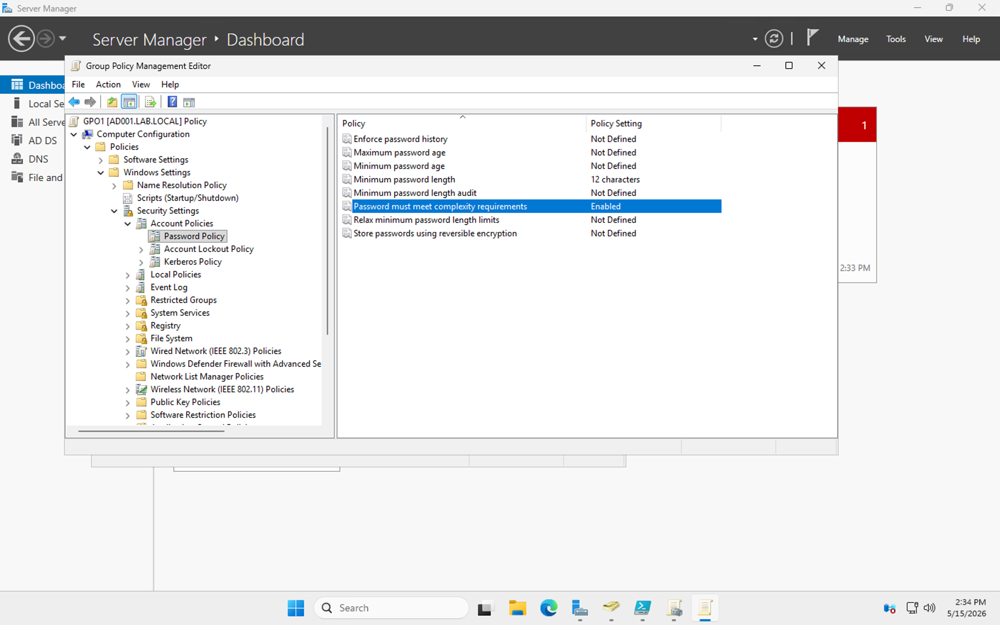

---

**Setting 3 — Machine Inactivity Lock (900 seconds)**

Navigated to: `Computer Configuration → Windows Settings → Security Settings → Local Policies → Security Options`

```
Interactive logon: Machine inactivity limit: 900 seconds
```

**📸 Screenshot — Machine inactivity limit set to 900 seconds:**

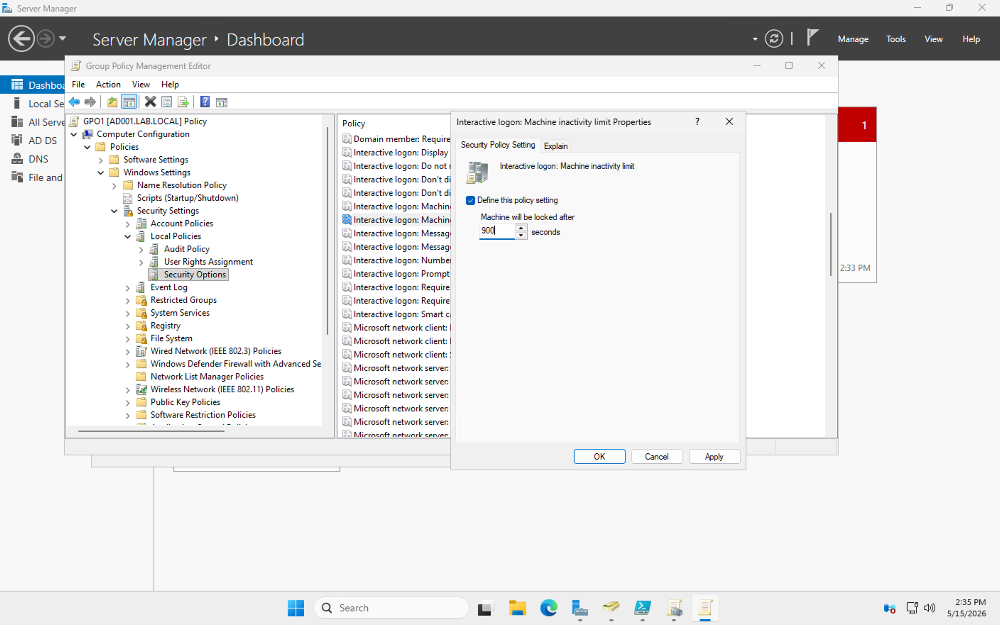

The properties dialog shows `Machine will be locked after: 900 seconds`. The navigation path on the left confirms this is under Security Options → Local Policies, separate from the password policy settings above.

---

**Setting 4 — USB / Removable Storage Blocked**

Navigated to: `Computer Configuration → Administrative Templates → System → Removable Storage Access`

```
All Removable Storage classes: Deny all access: Enabled
```

**📸 Screenshot — Removable Storage Access policy set to Enabled (all access denied):**

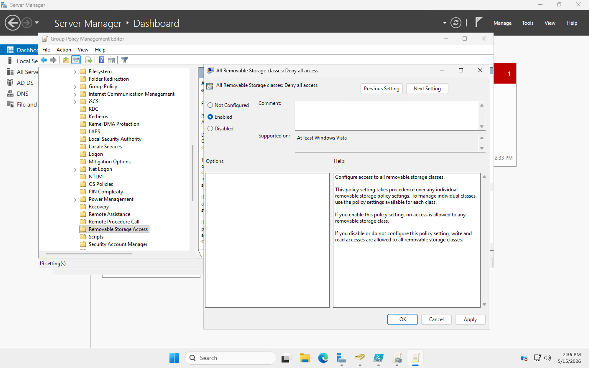

The `All Removable Storage classes: Deny all access` dialog shows `Enabled` selected. The help text on the right explains exactly what this does — no access is allowed to any removable storage class when this is enabled. This takes precedence over all individual removable storage policy settings. One setting, all USB devices, all machines in the IT OU.

---

## 💡 What I Took Away

The OU and group structure clicked for me as a design problem, not just a configuration task. The question isn't "how do I create users" — it's "how do I structure things so that access is automatic, consistent, and easy to revoke." Building the OU hierarchy first, then the groups inside them, then the users inside the groups, then the GPOs on top of the OUs — by the end of it access control felt like architecture rather than administration.

The GPO section was the most practically impactful. The USB block in particular — one `Enabled` toggle in Group Policy Management closes a data exfiltration vector across every machine in the OU simultaneously. No agent to install, no per-machine visit, no configuration drift. That kind of centralised enforcement is why Group Policy exists and why organisations that don't use it correctly end up with inconsistent security postures across their fleet.

Running everything through PowerShell alongside the GUI also reinforced something important: the GUI is for understanding, PowerShell is for doing it at scale. Clicking through wizards to understand the structure makes sense once. Scripting it means it's repeatable, auditable, and can be handed to someone else to run.

---

## 🔍 Verification Commands

```powershell
# Confirm the domain controller is running
Get-ADDomainController

# List all OUs
Get-ADOrganizationalUnit -Filter * | Select-Object Name, DistinguishedName

# Confirm all users exist and are enabled
Get-ADUser -Filter {Enabled -eq $true} | Select-Object Name, SamAccountName

# Verify group membership
Get-ADGroupMember -Identity "IT_Admins" | Select-Object Name

# Check GPO is linked to the IT OU
Get-GPInheritance -Target "OU=IT,DC=lab,DC=local"
```

---

## 📎 Resources

- [Active Directory Domain Services Overview](https://learn.microsoft.com/en-us/windows-server/identity/ad-ds/get-started/virtual-dc/active-directory-domain-services-overview)
- [Group Policy Overview](https://learn.microsoft.com/en-us/windows-server/identity/ad-ds/manage/group-policy/group-policy-overview)
- [PowerShell AD Module Reference](https://learn.microsoft.com/en-us/powershell/module/activedirectory/)
- [Azure Free Account](https://azure.microsoft.com/en-us/free/)
